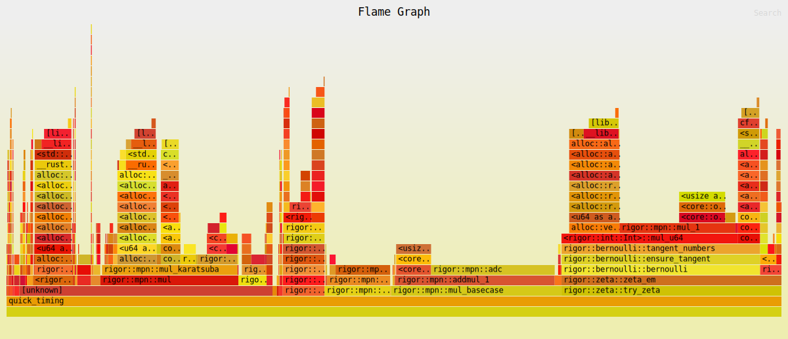

# rigor

Ball arithmetic for verified real computation, written in Rust from the
limbs up. Every result is an interval `[m ± r]` that provably contains the
true value — precision is a knob you turn, correctness is not.

```rust
use rigor::{Ball, elementary, gamma, constants};

let x = Ball::from_f64(1.5);
let y = elementary::exp(&x, 3330);        // e^1.5 to ~1000 digits
assert!(y.rel_accuracy_bits() >= 3330);   // certified, not estimated

let g = gamma::gamma(&x, 333);            // Γ(3/2) = √π/2, enclosed
let pi = constants::pi(332_270);          // 100,000 digits of π in ~0.1 s
```

```
$ cargo run --release --example digits_100k
pi: 99999 digits in 0.117s (certified 332254 bits, 64 spare)
  head: 3.1415926535897932384626433832795028841971693993751058209749
e: 99999 digits in 0.031s (certified 332254 bits, 64 spare)
  head: 2.7182818284590452353602874713526624977572470936999595749669
```

## Background

Ordinary floating point rounds silently: it hands back 53 bits with no
indication of how many are right. [Arb](https://arblib.org/) (now part of
FLINT) solved this with *ball arithmetic* — pair a full-precision midpoint
with a cheap radius bound, and make every operation responsible for proving
its own error. rigor is a from-scratch implementation of that idea: no GMP,
no MPFR, no dependencies at all in the core. Just `u64` limbs and
inequalities.

The governing rule: **a wrong enclosure is a soundness bug**, treated with
the same severity as memory unsafety. Speed matters (there's a whole
benchmark section below), but nothing trades away the inclusion property to
get it.

## Architecture

| layer | file | what it does |
|---|---|---|
| limbs | `src/mpn.rs` | GMP-style `u64`-vector kernels: carry-chain add/sub, schoolbook + Karatsuba multiply, Knuth division, shifts, integer sqrt |
| floats | `src/fp.rs` | arbitrary-precision dyadic floats with directed rounding (floor/ceil/toward-zero/away/nearest-ties-even) |
| radii | `src/mag.rs` | a 30-bit magnitude type that only ever rounds up |
| balls | `src/ball.rs` | midpoint + radius, with a proved error bound per operation |
| bigints | `src/int.rs` | minimal signed integers for binary splitting |
| elementary | `src/elementary.rs` | exp, ln, sin/cos, atan — argument reduction, Taylor series, rigorous tails |
| constants | `src/binsplit.rs`, `src/constants.rs` | π (Chudnovsky), e, ln 2 by binary splitting, behind a thread-safe cache |
| special | `src/gamma.rs`, `src/zeta.rs`, `src/bernoulli.rs` | Γ via Stirling + reflection, ζ via Euler–Maclaurin, Bernoulli numbers from exact tangent-number recurrences |

Three design decisions shape the codebase:

**Pure Rust instead of GMP bindings.** `gmp-mpfr-sys` doesn't build under
MSVC, and a numerics library that only works on Unix is half a library. The
mpn layer keeps GMP's API shape, so a GMP backend could be swapped in behind
a feature flag later; meanwhile the whole crate compiles anywhere Rust does,
in seconds. The `u128` widening ops compile to the same `mul`/`adc` chains
hand-written assembly would use — the core needs no `unsafe`.

**Precision belongs to operations, not values.** A `Float` is an exact
dyadic rational; each operation takes a precision argument, Arb-style.
Integers stay exact through any computation for free, and adaptive
precision-retry loops become trivial to write.

**Approximate, then certify.** Above 2048 bits, division and square-root
midpoints come from Newton iterations with precision doubling — which carry
no error proof at all. Rigor is recovered afterwards with one exact
multiplication: if `q` claims to be `a/b`, then `Δ = a − q·b` gives
`|a/b − q| ≤ |Δ|/b_low`, and that bound goes into the radius. The same
pattern covers sqrt via `Δ = m − s²`. This one idea took `ln` at 10,000
digits from 666 ms to 82 ms without weakening any guarantee.

## Correctness

The argument is structured so each piece is small enough to actually check:

1. **Exactly one place rounds.** Every `Float` operation reduces its exact
   result to a "window" — a limb vector plus an optional sticky term with a
   proven placement invariant (the top set bit sits at least 126 bits above
   the window bottom whenever the sticky term can be nonzero, so sticky bits
   can only influence the round/sticky decision, never a kept bit). One
   audited function, `from_window`, does all discarding of information.
2. **Radii only grow.** The `Mag` type has no rounding modes — every
   operation rounds up, and each carries its one-line over-approximation
   inequality in a comment next to the code.
3. **Series tails are computed, never assumed.** A truncated Taylor series
   contributes `|first omitted term| × geometric factor`, evaluated with
   64-bit directed arithmetic from certified bounds on the argument. A badly
   chosen term count can only widen the result, not break it.
4. **Domain edges fail loudly.** `try_div`, `try_ln`, `try_gamma`,
   `try_zeta` return `None` when the input ball touches a pole or leaves
   the supported region, rather than guessing.

The test suite then assumes all of the above is wrong anyway:

- **Inclusion property tests** (`tests/inclusion.rs`): for random inputs,
  the ball computed at precision p must contain the midpoint of the ball
  computed at precision 2p+128 — for every function, and for composed
  expressions. This is the contract; a failure here is a soundness bug.
- **Cross-algorithm identities** (`tests/identities.rs`): π computed three
  independent ways (Chudnovsky, 4·atan(1), Γ(½)²) must agree, likewise e
  and ln 2 two ways each, the Γ duplication formula, ζ(2k) closed forms,
  and trig addition theorems. Different code paths, overlapping balls.
- **Differential testing against Arb** (`tools/arb-diff`, run in CI on
  Linux): certified digit prefixes must match Arb's across functions,
  inputs, and precisions.
- **Known-value anchors**: digits of π, e, ln 2, ζ(3); factorials; tangent
  numbers; Bernoulli numbers through B₁₂.

The two-sided testing matters. During development, a factor-2³⁰ scale error
in the radius multiply passed every inclusion test — an enormously oversized
radius is still sound — and was caught only by a separate assertion that
bounds must also be *tight*. Soundness checks alone let a library degrade
into uselessly wide answers without ever failing.

The dependency problem — ball arithmetic forgetting that `x − x` is exactly
zero — is demonstrated rather than hidden: `cargo run --release --example
dependency_problem` shows the blowup, why algebraic form matters, and how
subdivision recovers tight ranges.

## Performance

Measured on an Intel Core Ultra 9 185H (Windows 11, single thread, criterion
medians, warm constant caches). Reproduce with `scripts/bench.ps1` or
`scripts/bench.sh`.

| op @ digits | 100 | 1,000 | 10,000 |
|---|---|---|---|
| ball mul | 164 ns | 4.1 µs | 115 µs |
| ball sqrt | 5.8 µs | 19 µs | 242 µs |
| exp | 39 µs | 296 µs | 30 ms |
| ln | 109 µs | 992 µs | 90 ms |
| sin | 74 µs | 782 µs | 95 ms |
| atan | 141 µs | 1.5 ms | 114 ms |

| special (warm caches) | 100 | 1,000 | 5,000 |
|---|---|---|---|
| Γ(1.5) | 1.5 ms | 44 ms | 1.12 s |
| ζ(3) | 753 µs | 43 ms | 3.0 s |

| constant @ digits | 1,000 | 10,000 | 100,000 |
|---|---|---|---|
| π (Chudnovsky) | 101 µs | 2.5 ms | 92 ms |
| e | 171 µs | 1.7 ms | 35 ms |
| ln 2 | 543 µs | 12 ms | 421 ms |

That's about 1.1 million verified digits of π per second at the 100k mark.

### Versus Arb and MPFR, measured

The design target was "within ~5× of Arb on elementary functions at
1k–10k digits." That target was missed, and the measured numbers say by
how much. `scripts/compare_arb.sh` reproduces the comparison
(`tools/arb-bench` times identical workloads against Arb and MPFR;
`tools/arb-diff` requires the answers to agree — it runs as a blocking CI
check). Full CI-generated table: [`docs/arb-comparison.md`](docs/arb-comparison.md).
Highlights at 1,000 digits (GitHub Actions runner):

| function | rigor | Arb | MPFR | rigor/Arb |
|---|---|---|---|---|
| exp | 380 µs | 31 µs | 73 µs | 12× |
| ln | 1.11 ms | 31 µs | 51 µs | 36× |
| sin | 959 µs | 41 µs | 39 µs | 23× |
| atan | 1.78 ms | 51 µs | 139 µs | 35× |
| Γ(3/2) | 59.5 ms | — (cached) | 1.77 ms | ~34× vs MPFR |
| ζ(3) | 55.2 ms | — (cached) | 221.8 ms | **0.25× vs MPFR** |

Reading the numbers honestly:

- **Elementary functions run 12–36× behind Arb at 1,000 digits and
  40–90× at 10,000.** The gap decomposes into: GMP's hand-tuned assembly
  limb kernels (vs safe-Rust `u128` arithmetic), truncated `mulhigh`
  products (rigor computes full products), rectangular series splitting
  (O(√N) full multiplications per series vs O(N)), and bit-burst / binary
  splitting evaluation for ln and atan. Each is a known, implementable
  technique — see the roadmap below.
- **The Arb column for Γ(3/2), ζ(3), and π is not a computation time.**
  Arb serves exact rational arguments and constants from special-cased
  paths and internal caches (sub-microsecond), so those ratios would be
  cache-hit comparisons, not algorithm comparisons. The MPFR column is the
  informative one there: rigor's Γ is ~34× slower than MPFR, while
  **ζ(3) is 4× faster than MPFR** at 1,000 digits — Euler–Maclaurin with
  warm Bernoulli caches beats MPFR's approach on that input.
- **Γ and ζ remain the weakest area at high precision** independent of the
  above: Bernoulli generation via the exact tangent-number recurrence is
  O(M²) big-integer operations, versus Arb's far faster zeta-based
  multi-evaluation with the von Staudt–Clausen theorem. Above ~5,000
  digits that cost dominates the call. The Euler–Maclaurin term count is
  capped so the cost stays bounded (a longer direct sum compensates,
  keeping inclusion rigorous).
- **π** uses the same Chudnovsky binary splitting as everyone else; at
  10⁵ digits the difference is GMP's FFT multiplication versus rigor's
  Karatsuba-only `mpn::mul` (O(n log n) vs O(n^1.585)).
- **MPFR** computes correctly-rounded point values without error bounds —
  it's the "what does rigor cost" baseline rather than a rigor competitor.

Roadmap by expected impact: Toom-3/FFT multiplication, `mulhigh` truncated
products, rectangular series splitting, zeta-based Bernoulli generation,
bit-burst ln/atan.

### Where the time goes



Flamegraph of the 10k-digit elementary workload (CI-generated; regenerate
with `scripts/flamegraph.sh` or the "Generate report assets" workflow).
The hot path is `mpn::mul` under ball multiplication, which is exactly
where it should be — everything else is bookkeeping.

Profiling drove real decisions. The first version of `ln` spent 80% of its
time inside integer-Newton square roots (each one did ~10 schoolbook
divisions); the fix was the approximate-then-certify scheme above, plus
rebalancing how much argument reduction each function does once sqrt cost
~5 multiplications instead of ~100.

## Limitations

- Real balls only; no complex arithmetic yet.
- ζ needs real s > 0, s ≠ 1, and non-integer s takes a slow path
  (`exp(−s ln j)` per term in the direct sum).
- exp/sin/cos reject |x| ≥ 2⁴⁰ rather than attempting gigantic quadrant
  reductions.
- Special functions above ~5,000 digits are Bernoulli-bound (see above).
- Decimal output truncates; it doesn't round the final digit.

## Running it

```
cargo test --release                    # full suite incl. property tests
cargo bench                             # criterion suite
cargo run --release --example digits_100k
cargo run --release --example dependency_problem
cargo run --release --example bench_smoke   # CI regression tripwire
./scripts/compare_arb.sh                # Linux + libflint-dev + libmpfr-dev
```

CI runs rustfmt, clippy with warnings denied, the release test suite on
both Linux and Windows/MSVC, the 100k-digit demo, the benchmark canary,
and the Arb differential job.

```
src/            the library
tests/          inclusion + identity suites
benches/        criterion: elementary, constants, special
examples/       digits_100k, dependency_problem, quick_timing, bench_smoke
tools/          arb-diff, arb-bench (Linux-only FFI against FLINT/MPFR)
scripts/        every number in this README is reproducible from here
```

Dual-licensed MIT or Apache-2.0.
